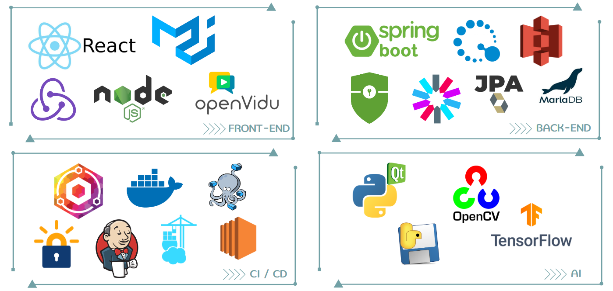
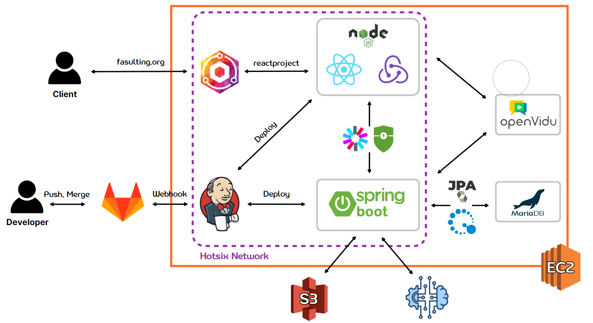
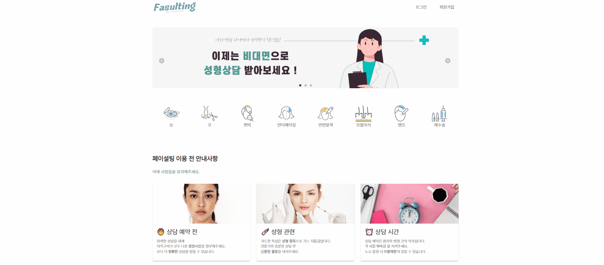
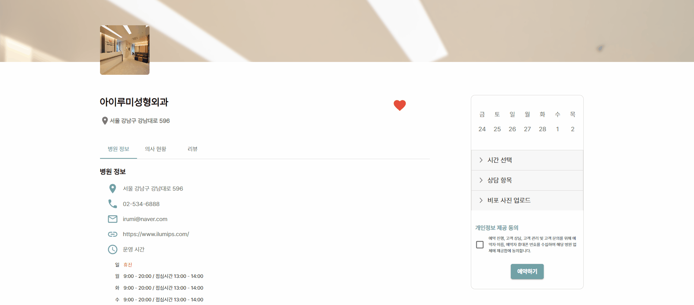
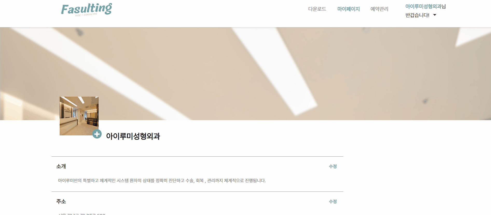
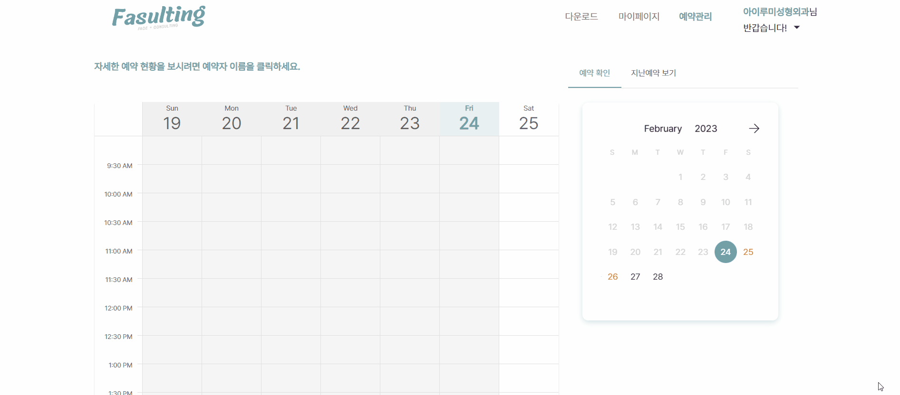

# 👩🧑 페이설팅 (face + consulting)

## ✨ 주제

- Face Edit GAN을 이용한 온라인 성형 상담

## 💻 기간

- 2023.01.09 ~ 2023.02.17

## 👀 목적 및 핵심내용

- **비대면 화상** 성형 상담을 통해 실시간으로 **성형 후 모습**을 보면서 상담 가능

## 👪 참여 인원 및 역할

- 강민정 BackEnd
- 구태희 BackEnd & Team Leader
- 권성현 FrontEnd
- 성정언 FrontEnd
- 장미림 FrontEnd
- 정원웅 Server

 

# ⚙︎ 프로젝트 컨셉 및 주요 기능

## 의도

- 실시간으로 원격 상담을 통해 성형 후 이미지를 예측할 수 있다.

## 예상 사용자

- 성형외과를 방문하기 힘든 경우
- 지방 거주 상담 희망자
- 비대면 상담 서비스 제공 희망 성형외과

## 주요 기능

- 성형외과 온라인 예약 서비스 제공
- 인공지능 모델을 이용한 성형 before & after 사진 제공
- 상담 후 견적 관리

## 세부 기능 설명

- 온라인 예약 서비스 제공
  - 성형외과의 운영 시간에 따른 예약 신청 가능
- 성형외과 전문의와 비대면 상담 기능
  - 성형 상담을 실시간 비대면 회의로 진행하며 상담자 성형 후 예상 이미지를 생성
  - 의사 기준에서 사용하기 편리하고, 상담자 입장에서 이해를 도울 수 있는 이미지 생성할 것
    - SC-FEGAN : [https://github.com/run-youngjoo/SC-FEGAN](https://github.com/run-youngjoo/SC-FEGAN)
- 성형 상담 견적 관리
  - 상담 후 결과 사진 및 견적 가격을 마이페이지에서 관리 가능(ex. 견적1, 견적2…)
  - 병원 별 상담 결과 비교

## 기대효과

- 시간/공간적 제약이 있는 상담 희망자에게 편리함을 제공
- 더 나아가 한국 성형 의료 관광에 더욱 힘을 보탤 수 있다.
- 실시간으로 성형 후 모습을 보여줌으로써 환자의 만족감을 높이고 의사의 부담감을 줄일 수 있다.

 

# 📃 개발 환경 및 문서

## 기술스택

## 개발환경

## Gantt chart

[간트차트](./etc/docs/%EA%B0%84%ED%8A%B8%EC%B0%A8%ED%8A%B8.md)

## 기능 명세서

[기능명세서](./etc/docs/%EA%B8%B0%EB%8A%A5%EB%AA%85%EC%84%B8%EC%84%9C.md)

## Entity Relationship Diagram

[ERD](./etc/docs/ERD.md)

## API 연동 규격서

[API 연동 규격서](./etc/docs/API%EC%97%B0%EB%8F%99%EA%B7%9C%EA%B2%A9%EC%84%9C.md)

## Wireframe

[Wireframe](./etc/docs/Wireframe.md)

## Sequence Diagram

[SequenceDiagram](./etc/docs/seqDiagram.md)

 

# 📌 시연 시나리오

### 메인화면

- 메인 배너 캐러셀 활용

  

 

### 병원 리스트 검색

- 메인 카테고리 확인 / 세부 카테고리 필터링 확인

  

 

### 병원 디테일 페이지

- 병원정보, 의사 현황, 리뷰 탭 눌러 해당 인덱싱으로 이동 가능

  

 

### 예약 진행

- 날짜 및 시간 선택

- 메인 카테고리, 세부 카테고리 최대 3개까지 선택

- 비포 사진 업로드 후 예약 가능

  

 

<!-- 5. 나의 예약, 나의 활동 페이지
   - 나의 예약
     
     예약 후 나의 예약 페이지로 자동으로 이동
     
     하루 전까지 예약 취소 가능
   - 나의 활동
     
     즐겨찾기 및 작성한 리뷰 확인 가능 -->

### 상담 대기

- 상담 대기 방에서 마이크, 캠 확인 가능

  

 

# 🏥 병원 계정

### 병원 정보 수정

- 기본 정보 수정 가능

  

 

### 다운로드

- 상담에 필요한 프로그램 다운로드 가능

  

 

### 예약 확인

- 스케줄표로 예약 확인 가능

- 이미지 다운로드 시 상담자의 비포 이미지 저장 가능

- 상담 시간 30분 전부터 상담 입장 버튼 활성화

  

 

### 상담 대기

- 의사 상담 방에서는 추가적으로 프로그램 다운로드 페이지로 링크되도록

   

 

### 상담 진행

- SC-FEGAN 프로그램 공유 화면

- 마스킹, 스케치를 통해 ai 성형 상담 진행

  

 

# ✍️ 상담 후

### 병원 - 견적서 작성

- 상담 끝난 후 병원은 소견서 작성

- 지난예약보기 최상단에서 최신 지난 예약 소견서 확인 가능

  

 

### 상담자 - 리뷰 작성 및 견적서 확인

- 상담 끝난 후 상담자에게 소견서 관련 모달 공지

- 완료된 상담은 지난예약에서 견적상세 클릭 시 소견서 확인 가능

- 견적 상세 옆 리뷰 작성 버튼을 통해, 상담 리뷰 작성 가능

  

 

# 👨‍🔧 관리자

### 병원 승인

- 병원 승인 후 병원 로그인 가능

  

### 신고된 리뷰 삭제

- 신고된 리뷰 삭제 가능

  

 

# 📽 페이설팅 UCC

